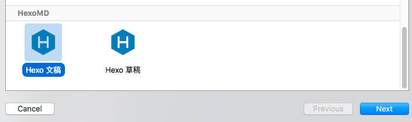
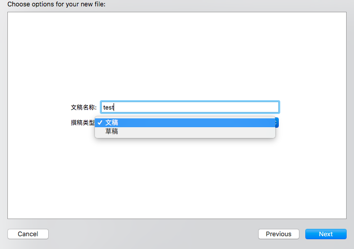
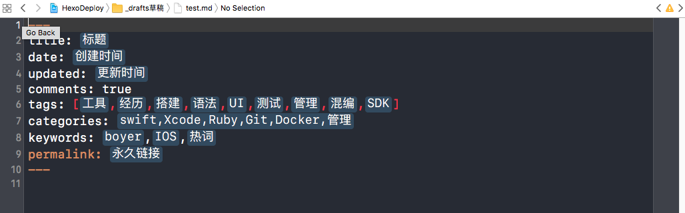

### 安装目录：

`~/Library/Developer/Xcode/Templates/File Templates/`  

### 在脚本目录下的两种安装方式：

推荐时候创建替身方式安装，这样便于版本库的管理。

第一种拷贝安装：
```sh
rake templates:install
```

卸载：
```sh
rake templates:uninstall
```

第二种，创建替身：
>目录名称不要存在空格，否则创建多个替身
```sh
sh lntemplates.sh 
```

### 使用效果如下：
新建文件时,可选文件模版：



支持正式文档，草稿模版选项：



创建完成，开始编写博客效果：


